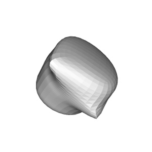
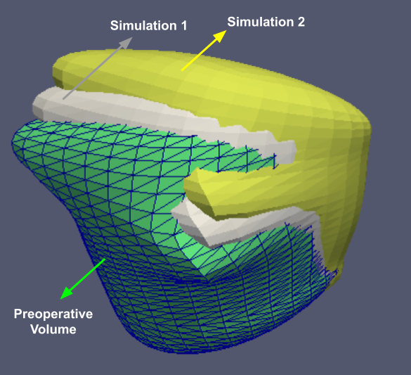
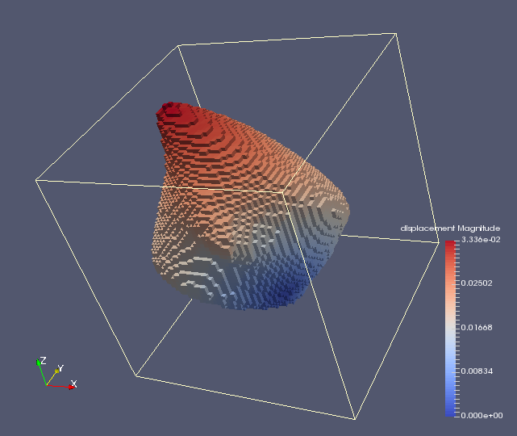
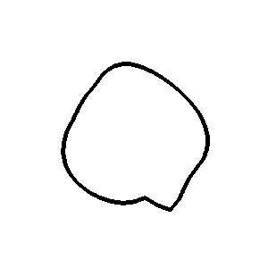

# Contour to Registration (2D-3D Registration)

## Requirements
#### Install the following softwares:
* [Python](https://www.python.org/downloads/) (Tested with version `3.7.5`)
* [Blender](https://www.blender.org/download/) (Tested with version `2.83`)
* [PyTorch](https://pytorch.org/) (Tested with version `1.5.1`)
* [Gmsh](https://gmsh.info/) (Tested with version `4.5.6`)
* [Elmer](https://github.com/elmercsc/elmerfem) (Tested with version `8.4`)

#### Python modules:
Setup your Python environment using the `requirement.txt` file. Run the following command in your shell to install the required packages.
```
pip install -r requirements.txt
```

## Build Tools
The Tools folder requires building. Run the following commands in your shell:
```
mkdir Tools/Build
cd Tools/Build
cmake ../Source/
make
```

If `VTK 8.1` is not found, you can pass the directory where you built it by adding `-DVTK_DIR=/path/to/VTK8.1/` to the `cmake` call.


Add the resulting build folders to your path (make sure your current directory is the build folder when you run these commands):
```
export PATH=$PATH:$(pwd)/simulationGen
export PATH=$PATH:$(pwd)/vtk2elmer
export PATH=$PATH:$(pwd)/voxelize
```

Alternatively, add path to your `~/.bashrc`.


## Synthetic Data Generation
To generate synthetic patient specific (Ps) data, set up the hyperparamaters in `Generate/config.py` file, and run the following commands:

```
mkdir PsData/       # This folder must also be defined in config.py as Data_path_ps
cd Generate/
python patient_specific_data_generate.py
python volume2contour.py
python preprocessData.py
```

## Data Visualization

3D Mesh:




Simulation:




Voxelization & Displacement Field (Output):




Contour (Input):




For visualizations use [Paraview](https://www.paraview.org/).

#### References:
This repo is built upon the code by Micha Pfeiffer, which is available [here](https://gitlab.com/nct_tso_public/cnn-deformation-estimation/-/tree/master/).
